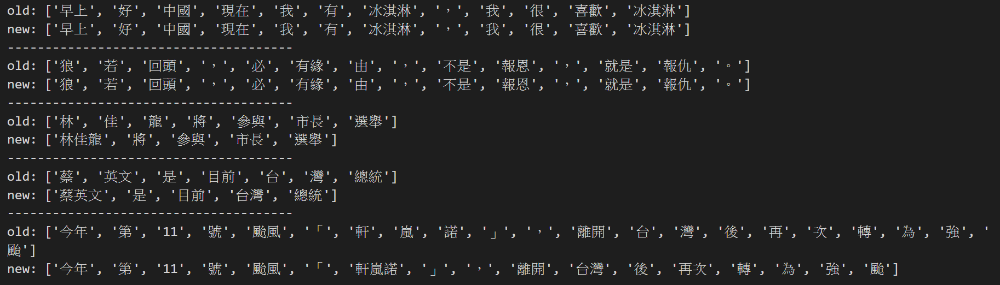

# Text-Segmentation

## Advanced Text Segmentation - ATS


## Introduction
將**句子**或**文章**做斷詞處理，為 NLP 下游任務提供更有效率的處理。
## Usage
```
git clone https://github.com/JiaDians/Text-Segmentation.git
```
```python 
from text_segmentation import text_segment
in_str = '今年第11號颱風「軒嵐諾」，離開台灣後再次轉為強颱'
ts = TextSegment()
output = ts.get_segment_list(in_str)
print(output) # ['今年', '第', '11', '號', '颱風', '「', '軒嵐諾', '」', '，', '離開', '台灣', '後', '再次', '轉', '為', '強', '颱']
```
## Detail
此專案有加入新詞偵測 model，如需增加新詞辨識精確度，請在 data.txt 內提供新聞文章內容(單行)，目前資料量達到 **600多篇新聞**
## Demo
